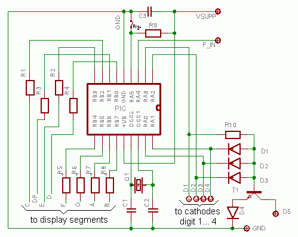
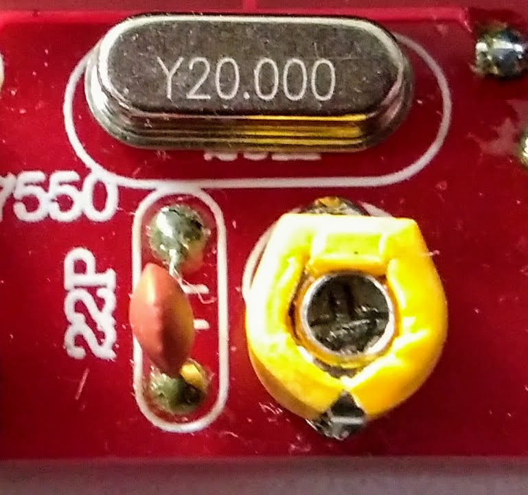

# About This Repo

This repo contains the original public domain source code for Wolfgang Buescher's (DL4YHF)
[PIC based frequency counter](https://www.qsl.net/d/dl4yhf/freq_counter/freq_counter.html) in the directory [`DL4YHF`](DL4YHF) as a reference.
His counter, in turn, is based on the earlier work of [MADLAB](http://www.madlab.org/kits/frqmeter.html),
where they already used the idea of timed measurement based on a software loop with a known execution time.

## Hardware
### Wolfgang's Original Device
The counter is based on a Microchip PIC16F628A processor, which counts the input signal and displays the result
on five seven-segment LEDs. My actively developed FW [counter_hires_event.asm](counter_hires_event.asm)
requires Wolfgang's so-called display variant #2 (see below) with common cathode displays.



### The Cheap DIY Kit


This variant #2 is available as an inexpensive *"Crystal Oscillator Frequency Counter Tester"* 
DIY kit from several sources from China, which offers the counter core
plus an additional crystal test oscillator, see the schematics below that were provided by
[tardate](https://github.com/tardate/LittleArduinoProjects/tree/master/Equipment/FrequencyCounterKit)
under his [MIT license](https://github.com/tardate/LittleArduinoProjects/blob/master/LICENSE).


#### HW Modifications
If you build the counter you should omit the not-so-reliable crystal test oscillator section in the lower left of the schematics
or even [convert it to a simple preamplifier](https://youtu.be/0BxpMm6SLoE?t=284).

## Firmware
This project offers three different firmware variants, which are provided as `*.hex' files
which can be programmed into the PIC processor using a HW tool such as Microchip's PICkit
or my [ArdPicProg](https://github.com/Ho-Ro/ArdPicProg).

To program the PIC it must be removed from the counter because in-circuit programming is not supported
by the counter hardware. If you build the counter you should use a high-quality socket for the PIC
that allows several processor plugging cycles.

If you make changes to the firmware source code, the `*.hex` files can be recreated with the [GNU gpasm](https://gputils.sourceforge.io/).
If you want to rebuild the firmware under Linux using the provided [Makefile](Makefile), simply type `make`.

### 1. [counter_DL4YHF.asm](counter_DL4YHF.asm)
This version matches Wolfgang's original firmware, I have modified his source code [`DL4YHF/counter.asm`](DL4YHF/counter.asm)
slightly so that it can be assembled with GNU `gpasm`. The resulting [`counter2_DL4YHF.hex`](counter2_DL4YHF.hex) file is identical
to Wolfgang's original version [`DL4YHF/counter2.hex`](DL4YHF/counter2.hex). This can be tested with `make compare`.

If you want to deep-dive into Wolfgang's clever coding, read his explanation [how it works](HowItWorks.md).

### 2. [`counter.asm`](counter.asm)
A 2nd variant [`counter.asm`](counter.asm) differs in three minor details:
1. Underflow is shown with the zero in the rightmost (5th) digit.
2. Overflow is shown with the E in the 1st digit.
3. Gate time is 1 s for frequencies < 101760 Hz -> display resolution 1 Hz up to 99999 Hz.
   This change was inspired by [TheHWcave](https://github.com/TheHWcave/PIC-freq.counter-modification).

This looks better on 5-digit units and is easier to recognise at first glance.

### 3. [`counter_hires_event.asm`](counter_hires_event.asm)
My actively developed 3rd FW variant [`counter_hires_event.asm`](counter_hires_event.asm) that is heavily based
on the good work of [TheHWcave](https://github.com/TheHWcave/PIC-freq.counter-modification)
offers a lot of improvements:

* Measurement range > 100 MHz (out of PIC prescaler spec but may work)
* 1 Hz resolution up to 99999 Hz (range < 100800 Hz).
* Round the displayed value for frequencies > 99999 Hz.
* 100 mHz resolution for values up to 999.9 Hz.
* Hi-res (two-decimals) mode with 10 mHz resolution up to 255.99 Hz.
* Toggle three-decimals mode with 1 mHz resolution up to 60.999 Hz with key press.
This allows to measure the mains frequencies very precisely. The selection is stored in EEPROM.
* Zoom temporarily into the 5 lowest digits while measuring frequencies up to 3.2 MHz, this allows
to calibrate the counter, apply exact 1 MHz, e.g. from a GPDSO and adjust to 00000.
* More consistent frequency display layout:

```
The display shows the signal frequency in Hz, kHz or MHz
according to the following table:

-------------------------
|           |  DISPLAY  |
| Frequency | Freq mode |
|-----------|-----------|
| < 1 Hz    |        0  |
| 1 Hz      |    1.000. |  Two Hz-dots are steady (three-digits mode)
| 10 Hz     |   10.000. |  Two Hz-dots are steady (three-digits mode)
| 1 Hz      |     1.00. |  Two Hz-dots are steady
| 10 Hz     |    10.00. |  Two Hz-dots are steady
| 100 Hz    |   100.00. |  Two Hz-dots are steady
| 255.99 Hz |   255.99. |  Two Hz-dots are steady
| 256 Hz    |    256.0. |  T.o Hz-dots are steady
| 999.9 Hz  |    999.9. |  Two Hz-dots are steady
| 1000 Hz   |    1.000  |  One kHz-dot is steady
| 10.00 KHz |   10.000  |  One kHz-dot is steady
| 100.0 KHz |   100.00  |  One kHz-dot is steady
| 1.000 MHz |   1:0000  |  One MHz-dot is flashing
| 10.00 MHz |   10:000  |  One MHz-dot is flashing
| 100.0 MHz |   100:00  |  One MHz-dot is flashing
-------------------------
'.' = steady display dot (two dots: Hz; one dot: kHz)
':' = flashing display dot (one dot: MHz)
The flashing dots change their state with the measurement rate
```

#### Three-digits mode
Frequencies < 61 Hz can be displayed with three decimal digits e.g. `50.123.`.
To switch between two- and three-digits mode, press the key until the mode changes.
The mode selection is stored permanently in EEPROM.
The 61 Hz is a compromise between the conversion time (increasing with frequency) and the
possibility of measuring the typical mains frequencies 50 Hz or 60 Hz precisely.
A test measurement of the European mains frequency shows almost exact mHz matching
with the realtime values available online from https://www.netzfrequenzmessung.de/.

#### Frequency "zoom"
In the frequency range 100 ... 3200 kHz, the display can be "zoomed" to a resolution of 1 Hz
by holding down the button. This temporarily selects a measuring range of 1 s gate time
without prescaler, which results in a resolution of 1 Hz, e.g. a signal of exactly 1012345 Hz
results in a display of `1:0123`, where `:` represents the flashing dot, which means 1.0123 MHz.
During the button press the display is switched to 1 Hz resolution mode (in which only the 5 lower digits
are displayed) and shows `1:2:3:4:5:` with all 5 dots flashing.

This mode is intended to calibrate the quartz oscillator; apply an exact 1 MHz signal
(e.g. from a GPSDO), hold down the button and adjust the variable capacitor until the display
shows `0:0:0:0:0:`. This will give you a (short term) accuracy down to 1ppm.

Remark: If the variable capacitor is mounted according to the silkscreen picture, the top side
is connected to the hot side and the calibration is disturbed when you use a metal screwdriver.
You should mount the capacitor 180° rotated to have top connected to GND.



#### Switching between frequency and event counter mode
When switching on, the current working mode is briefly displayed, either `FrEQ` or `Count`.
If you press and hold the button while switching on, the display alternates between these two modes.
If the button is released during the desired mode, this mode is permanently saved in the EEPROM
and the device operates either as a frequency or event counter, even after a restart

## License
The work (except [Wolfgang's original code](DL4YHF/counter.asm) that is in the public domain) is released under GPL v3.

-----

## Original [`readme.txt`](DL4YHF/readme.txt) from Wolfgang's [source code archive](https://www.qsl.net/dl4yhf/freq_counter/freq_counter.zip):

````
Simple frequency counter with a PIC microcontroller
---------------------------------------------------

by Wolfgang Buescher, DL4YHF

This directory contains the sourcecode (*.asm)
and the assembled firmware (*.hex) for
DL4YHF's simple frequency counter.

Features:
 - 4 or 5 LED digits
 - automatic range switching
 - input range 1 Hz ... 50 MHz (maybe a bit more)
 - uses a cheap PIC16F628
 - clocked with 4 or 20 MHz crystal
 - for common anode or common cathode display
 - optional power-saving mode


There are different firmware variants !
----------------------------------------------

Different firmware variants are available,
  counter1.hex  to counter3.hex, all assembled
  from the same sourcecode counter.asm,
  using Microchip's MPLAB with MPASM and TWO
  project files (FreqCnt1.mcp and FreqCnt2.mcp).
Unfortunately I could not convince MPLAB to pro-
duce two different hex files, so I had to rename
them manually.

What's the difference between COUNTER1, COUNTER2,
and COUNTER3 ?

COUNTER1.HEX is the firmware for the first prototype,
where PIC and display are on the same (bread-)board.
It is considered to be the ult board, with as low
power consumption as possible, but with limited
resolution at HF (256 Hz resolution at 50 MHz input).

We later decided to put the PIC and the LED display
on two separate boards, to save space on the front
panel. Some display output pins were swapped to make
the electrical wiring easier. For the second variant,
use the firmware COUNTER2.HEX . The PIC consumes
about 3 mA more for this variant because of the
20 MHz clock. The resolution is 64 Hz at 50 MHz input.
COUNTER2 (like COUNTER1) drives COMMON CATHODE displays.
'COUNTER2.HEX' is also used in the DL-QRP-AG's dipper,
and in the digital frequency display for Miss Mosquita.

COUNTER3 uses the same pins as COUNTER2, but the control
outputs are inverted to drive COMMON ANODE display.
In the circuit, use PNP instead of NPN for T1 to drive
the 5th digit of a COMMON ANODE display, furthermore
connect D1..D4 with reverse polarity, and connect D4
to Vsupp instead of GND.


The following table shows the differences
(use a simple text editor with a fixed pitch font
 like courier new to view this file !)


 Function    |    COUNTER1      |     COUNTER2
------------------------------------------------------
  1st digit  | PA3 = PIC pin  2 | PA3 = PIC pin  2
  2nd digit  | PA0 = PIC pin 17 | PA2 = PIC pin  1
  3rd digit  | PA2 = PIC pin  1 | PA0 = PIC pin 17
  4th digit  | PA1 = PIC pin 18 | PA1 = PIC pin 18
  5th digit  | NAND-combination | NAND-combination
  Segment a  | PB0 = PIC pin  6 | PB6 = PIC pin 12
  Segment b  | PB1 = PIC pin  7 | PB7 = PIC pin 13
  Segment c  | PB5 = PIC pin 11 | PB2 = PIC pin  8
  Segment d  | PB3 = PIC pin  9 | PB0 = PIC pin  6
  Segment e  | PB2 = PIC pin  8 | PB3 = PIC pin  9
  Segment f  | PB6 = PIC pin 12 | PB4 = PIC pin 10
  Segment g  | PB7 = PIC pin 13 | PB5 = PIC pin 11
  Segment DP | PB4 = PIC pin 10 | PB1 = PIC pin  7


Notes:
 - The PIC used here is a PIC16F628 (18 pins), but
   there are a number of pin compatible other PICs
   out there which may also be used (with some
   firmware modifications). Some are even cheaper..
 - COUNTER1 as well as COUNTER2 are "layout-
   optimized" for a display by Kingbright, SC39-11SRWA .
 - Use a "LOW-POWER"/"High-efficiency" or "superbright"
   display ! Don't expect a 20-year old display from
   the junkbox to give an impressive display with
   a few milliamperes per digit..


Apart from this, both variants have exactly the same
functionality (they are different VARIANTS, but both
firmwares will always have the same VERSION).


  .---.

The circuit diagram, breadboard layout,
and description of the PIC frequency counter is at:

   c:\myhome\freq_counter ,
or
   www.qsl.net/dl4yhf/freq_counter .


Good luck and happy homebrewing,

  Wolfgang ("Wolf") DL4YHF .

````
